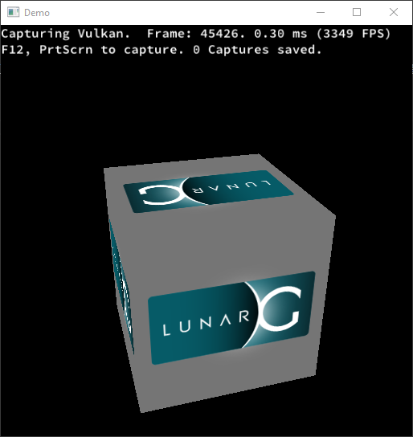
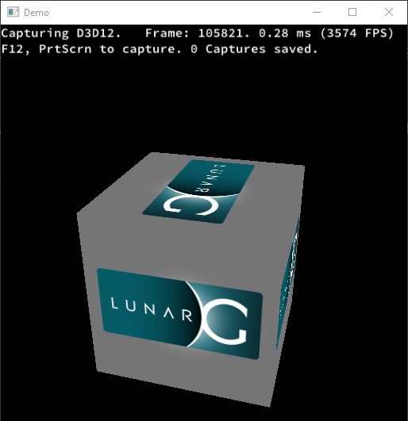
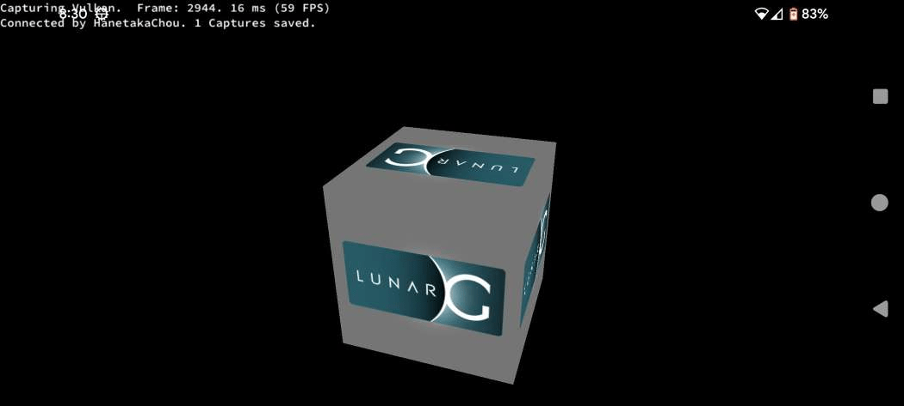

PAL Cube, of which PAL(Platform Abstraction Layer) is to encapsulate the underlying Vulkan and Direct3D12 API, is a Direct3D12 port of the original [Vkcube](https://github.com/KhronosGroup/Vulkan-Tools/tree/master/cube) demo.  

  
  

  
  

  
  
